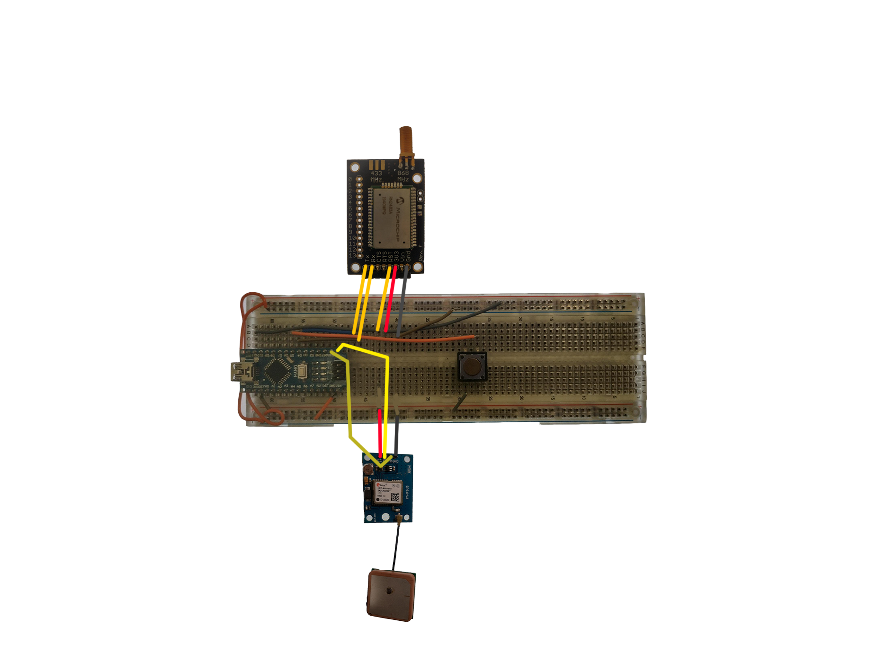
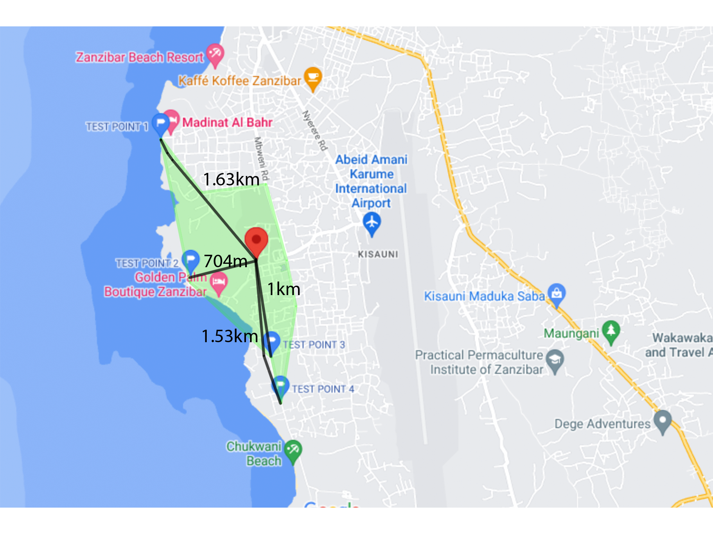

# RN2483

The RN2483 is a fully-certified 868 MHz and 433MHz module based on wireless LoRa ® technology. 

## 1. GPS-Lora tester

The GPS-Lora tester is a small prototype constructed on a breadboard that is designed and made with two very specific goals in mind.

1. Learning to work with the RN2483.

2. Providing a way to test the range of the RN2483 in and around Mbweni, Zanzibar.

#### 1.1 Learning to work with the RN2483

The first source you should always consult is the datasheet. In this case the datasheet can be found here: [RN2483](https://ww1.microchip.com/downloads/en/DeviceDoc/RN2483-Data-Sheet-DS50002346E.pdf). In this particular case an RN2483 board was used, all we needed to do was connect the right pins to a microcontroller.

###### 1.1.1 Registring the RN2483 on TTN

The following steps will guide you with registering a new device on TTN

1. Account
   
   1. Register a new account at [TTN](https://account.thethingsnetwork.org/register)
   
   2. Log into your TTN account
   
   3. Navigate to the [console](https://console.cloud.thethings.network)
   
   4. Select Europe (or a different region, depending on what region is closest to you)

2. Application
   
   1. Navigate to your [applications](https://eu1.cloud.thethings.network/console/applications)
   
   2. Add an application and assign an ID
   
   3. Navigate to the tab called "end devices" (fig 1.1)

3. Add end device
   
   1. Add an end device by pressing the button called "+ Add end device"
   
   2. At the top select "Manually"
   
   3. Before we can continue we need to find out the DevEUI of the module
      
      1. Upload the following code to your Arduino Nano: [code](./code/RN2483_command_interface.ino)
      
      2. Connect an antenna to the RN2483
      
      3. Connect the RN2483 the same way as in 1.2.1 (don't connect the GPS board)
      
      4. Open the Serial monitor with baud rate on 9600
      
      5. Enable "Both NL & CR" in the dropdown menu next to the baud rate
      
      6. Type in the input field `sys get ver`
         
         1. If you get no output in the serial monitor, continue to the troubleshooting section (no response from the RN2483).
         
         2. If you get a response from the RN2483 then you can continue with this guide
      
      7. Type in the input field `mac get deveui`
         
         1. If you get no output in the serial monitor, continue to the troubleshooting section (no response from the RN2483).
         
         2. If you get a response from the RN2483, write it down. This is your DevEUI
   
   4. Navigate to TTN and add the following settings to your lorawan end device:
      
      | Setting                     | Option                                                             |
      | --------------------------- | ------------------------------------------------------------------ |
      | Frequency plan              | Europe 863-870 Mhz (SF9 for RX2 - recommended)                     |
      | LoRaWAN version             | LoRaWAN Specification 1.0.2                                        |
      | Regional Parameters Version | RP001 Regional Parameters 1.0.2                                    |
      | DevEUI                      | Copy paste here the DevEUI that you obtained in the previous steps |
      | AppEUI                      | You can press "Fill with zeros" here                               |
      | AppKey                      | Press the button "Generate"                                        |
   
   5. Press "Register end device"
   
   Congratulations! You've just registered a new end device with TTN. Any data from this will end device will be visible on TTN.

###### 1.2.1 Connecting the RN2483 and GPS to Arduino Nano



###### 1.2.2 programming the Arduino Nano

To interface with the RN2483 [a library](https://github.com/jpmeijers/RN2483-Arduino-Library) was used. This library sends most of the commands needed to connect to TTN automatically. All that was needed to do was input the right keys and format the data you want to send.

The position of the testing circuit was taken from the GPS sensor using the library called [TinyGPS++](http://arduiniana.org/libraries/tinygpsplus/).
[Example code](https://github.com/jpmeijers/RN2483-Arduino-Library/blob/master/examples/ArduinoUnoNano-basic/ArduinoUnoNano-basic.ino) was used and adapted into the following code: [GPS-lora-tester.ino](https://github.com/Dacetylan/ci-poc-lorawan/tree/main/code/code).

Don't forget to replace the value of the variable called "appEui" with the appEUI obtained from TTN.  Also replace the value of the variable called appKey with the appKey obtained from TTN.

Most of the code is copied from the example code, the following code might need a small explanation.

> Float into bytes

```cpp
union dataUnion {
    float dataFloat;
    unsigned char dataBytes[4];
};
/*
...
*/
byte payload[8];

dataUnion latitude;
latitude.dataFloat = (float)gps.location.lat();
dataUnion longitude;
longitude.dataFloat = (float)gps.location.lng();

memcpy(payload, latitude.dataBytes, sizeof(latitude.dataBytes));
memcpy(payload+sizeof(latitude.dataBytes), longitude.dataBytes, sizeof(longitude.dataBytes));
```

The code above converts floats into bytes and then copies those bytes into 'payload'. The function from the library we are using to send data only accepts bytes as an input.

#### 1.2 Testing the range of the RN2483 around Mbweni, Zanzibar

The range was tested at the following points.

| Test Point   | Result  | Distance |
| ------------ | ------- | -------- |
| Test point 1 | FAIL    | 1.63km   |
| Test point 2 | SUCCESS | 704m     |
| Test point 3 | SUCCESS | 1km      |
| Test point 4 | SUCCESS | 1.53km   |

The area in green is the area that has been tested.



## 2. Troubleshooting the RN2483

The development of the GPS-Lora tester thaught us a lot of things about the RN2483. Below is a list of problems we encountered and how we attempted to solve them.

- Join problems

- Limitations of the library

- No response from the RN2483

#### 2.1 Join problems

At the beginning of development of the GPS-Lora tester a lot of join problems with the module were found. At times the module would connect instantly with the gateway, some other times it would take many tries (sometimes up to 10) to connect with the gateway

The first step we took while diagnosing these inconsistent join times was to manually send "mac join otaa" to the module using [RN2483_command_interface.ino](./code/RN2483_command_interface.ino).

There are several different reponses we have ecountered from the RN2483

| Response      | Definition                                                                                               |
| ------------- | -------------------------------------------------------------------------------------------------------- |
| ok            | The settings on the module are configured correctly and the command was run                              |
| invalid_param | The command was not entered correctly, check for typos                                                   |
| keys_not_init | Some of the settings were not configured correctly, confirm that AppEUI and AppKey are entered correctly |
| denied        | The module tried to join the network but was rejected (likely due to timeout)                            |
| accepted      | the module has joined successfully!                                                                      |

If the module is still unable to join (denied), it might be possible that there is no TTN coverage in the area. Check if your gateway is in range and still online!

#### 2.2 Limitations of the library

The library that is used on the GPS-Lora is very limited in functionality. This library is not sufficient to be used on the PCB. Some of the limitations that we have encountered:

| Limitation         | Use case                                                                                                                                                                                                                                  |
| ------------------ | ----------------------------------------------------------------------------------------------------------------------------------------------------------------------------------------------------------------------------------------- |
| TX without joining | It should be possible to only join once and then transmit even without rejoining the network.                                                                                                                                             |
| Verbose debugging  | When there is any problem the library outputs the same message which does not help at all with debugging, RN2483 has an extensive response system that allows you to debug your problem easily. The library ignores this response system. |
| Usage on PCB       | Using the library on the PCB is not possible in our opinion.                                                                                                                                                                              |
| Custom settings    | A lot of settings are set by the library without the user knowing it. This means that you severely limit the functionality of the module for no reason other than being user friendly.                                                    |

#### 2.3 No response from the RN2483

This is a problem that has not yet been sovled. From our experience it seems like the module sometimes "gives up" and refuses to ever respond to UART commands. It almost seems like it isn't powering on.

Troubleshooting steps we've taken:

| Step                            | Result                                             |
| ------------------------------- | -------------------------------------------------- |
| Checking for shorts             | No shorts found                                    |
| Power cycling the board         | No difference                                      |
| Monitoring with an oscilloscope | There was nothing to see other than a lot of noise |

One of these non-functional RN2483 modules has started working again a few days later.

## Programming the SAMD21 to work with the RN2483

The RN2483 on the PCB is connected to UART0. It works exactly the same way as with arduino nano except without the library.

Documentation of the code can be found [here](https://github.com/DaanDekoningKrekels/ci-poc-code).
