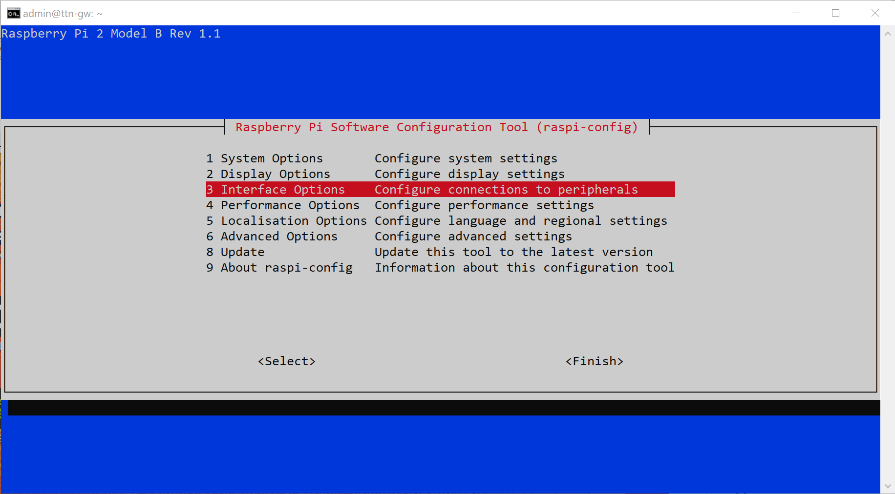

## Configuring the Gateway

To configure the RPi as a gateway we are using a IMST iC880A LoRaWAN Concentrator and The Things Network.
Currently TTN is on its V3 Stack. This uses a secured and encrypted connection to it's LNS for added security.
For this purpose Semtech provides open-source software called Basic Station.
Basic Station exchanges data as JSON encoded objects over secure WebSockets.  The gateway identifies itself with a secret API key, ensuring it’s authorised.
In addition to security, the protocol allows for LNS discovery and load sharing and also includes CUPS or Configuration and Update Server allowing for easy management of gateway fleets.

>> This section is largely based on <a href="https://www.beyondlogic.org/lorawan-upgrading-to-basic-station-and-the-things-network-v3-stack/">LoRaWAN: Upgrading to Basic Station and The Things Network V3 Stack by Craig Peacock</a>


### Installation

We are going to clone Basic Station from its GitHub repository and build and executable on our target RPi.

1. Connect to your RPi console: `ssh admin@192.168.100.102`
2. Run an update: `sudo apt-get update && sudo apt-get -y upgrade`
3. Clone the repository: `git clone https://github.com/lorabasics/basicstation.git`
4. Open the created directory: `cd basicstation`
5. Build the executable: `make platform=rpi variant=std`

During the build process, dependencies such as mbed TLS and the libloragw SX1301/SX1302 Driver/HAL are downloaded and compiled.


### Configuration

The RPi communicates with the Concentrator over SPI. However this is disable by default.
The SPI interface can be enable using the Software Configuration Tool, raspi-config.
Do note the available options and where they are located in the menu can vary by version.

1. Go to the RPi configuration screen: sudo raspi-config
2. Select 3 Interface Options with the Up/Down keys.
	>>
	>> 
3. Select I4 SPI and when promted select "Enable".
	>>
	>> 
4. Also under 3 Interface Options, select I6 Serial Port.
	>>
	>> 
5. When prompted answer "No" to disable shell messages, but leave the serial port enabled by answering "Yes" on the second prompt.
6. Select "Finish" with the Left/Right keys to exit raspi-config.

To be able to connect to TTN we need a couple of configuration files.
To keep them together create a new folder called TTN in the home directory.

1. `cd ~`
2. `mkdir TTN`
3. `cd TTN`


---


#### tc.uri

The first thing Basic Station needs to know is which LNS to connect with.
Use <a href="https://console.cloud.thethings.network/">The Things Network Cluster Picker</a> to determine the closest geographically located server to minimize network latency.
For Europe and Africa the best current option is Europe 1: eu1.cloud.thethings.network
After comes the port number. Packet transport with the The Things Network V3 LNS happens on port 8887.
To create the file:

1. To create the file and open it in the nano editor type: `nano tc.uri`
2. In nano type: `wss://eu1.cloud.thethings.network:8887`
3. Press Ctrl+O and Enter to save the file.
4. Press Ctrl+X to exit the nano editor.


---


#### tc.trust

Next we need to establish a trust relationship. This involves copying the root certificate (expires Jun 2035) to a file called tc.trust.

1. `curl https://letsencrypt.org/certs/isrgrootx1.pem.txt -o tc.trust`


---


#### tc.key

We also need an API key from TTN for authorisation by registering the gateway.
For this we need the gateway/station's EUI, which is it's MAC address with `FF:FE` added in the middle.
In our example the MAC address is `B8:27:EB:4D:56:2F`, so the EUI is `B8:27:EB:FF:FE:4D:56:2F`.

Now that we have the EUI we can head over to the TTN Console for registration.

1. Open a browser on your computer and go to: https://eu1.cloud.thethings.network/console
2. On the login page login to your account or create a new user by clicking on "Register".
	>>
	>> 
	>> ---
	>> 
3. Once logged in, select "Go to gateways".
	>>
	>> 
4. If you are a collaborator on any gateways you can see them on this page. To add a new one select "Add gateway" on the top right.
	>>
	>> 
5. Fill in a Gateway ID of your choice. Make sure it is easily identifiable by this name.
6. Fill in the Gateway EUI.
7. Fill in a name. This is only as heading in the console.
8. Scroll down to Frequency plan under LoRaWAN options and select the frequency your end devices/nodes will work on. In this example this is "Europe 863-870 MHz (SF9 for RX2 - recommended)
9. The other settings can be left on default. Click on "Create gateway" to finish the registration.
	>> 

Your gateway is now registered, but we still need to get an API key for authorisation.

1. In your browser go to: https://eu1.cloud.thethings.network/console/gateways
2. Select your gateway.
3. On the "Overview" page, select "API keys" on the left side panel.
	>>
	>> 
4. Click on "Add API key" on the top right to create a new key.
	>>
	>> 
5. Give the key a name.
6. And add at least the following right: "Link as Gateway to a Gateway Server for traffic exchange, i.e. write uplink and read downlink".
	>>
	>> 
7. Click on "Create API key".
8. In the following window make sure to copy the key and write it down somewhere. You will not be able to get it later on, though you can always create a new one.
	>> 

Now head back over to the Git Bash console and enter the following commands:

1. `export LNS_KEY="your-API-key-here"`
2. `echo "Authorization: Bearer $LNS_KEY" | perl -p -e 's/\r\n|\n|\r/\r\n/g' > tc.key`


---


#### station.conf

Finally create the station's configuration file.

1. To create the file: nano station.conf
2. Add the following code to the file:
```bash
{
   "radio_conf": {                  /* Actual channel plan is controlled by the server */
       "lorawan_public": true,      /* is default */
       "clksrc": 1,                 /* radio_1 provides clock to concentrator */
       "device": "/dev/spidev0.0",  /* default SPI device is platform specific */
       "pps": true,
       "radio_0": {
           /* freq/enable provided by LNS - only hardware-specific settings are listed here */
           "type": "SX1257",
           "rssi_offset": -166.0,
           "tx_enable": true
       },
       "radio_1": {
           "type": "SX1257",
           "rssi_offset": -166.0,
           "tx_enable": false
       }
       /* chan_multiSF_X, chan_Lora_std, chan_FSK provided by LNS */
   },
   "station_conf": {
     "log_file":    "stderr",
     "log_level":   "DEBUG",
     "log_size":    10e6,
     "log_rotate":  3
   }
}
```

You can find out more about what this file does in <a href="https://lora-developers.semtech.com/build/software/lora-basics/lora-basics-for-gateways/?url=conf.html">the official Semtech documentation.</a>

The only part you are likely to want to change is the log settings. Instead of logging to file, we send the output to stderr for debugging.
The log levels are: XDEBUG, DEBUG, VERBOSE, INFO, NOTICE, WARNING, ERROR, CRITICAL
After the gateway works satisfactory you can choose a log level further down the line with less messages to minimise ware on the flash memory.

That concludes the configuration of the gateway.


---


### Reset

The Concentrator we are using makes use of the SX1301 Digital Baseband chip.
To work this chip needs to be reset on power-up through GPIO. We will use a script from <a href="https://github.com/Lora-net/lora_gateway/blob/master/reset_lgw.sh">mcoracin</a> to do this.
In this example the Concentrator's reset pin is connected, through a 3rd party adapter, to pin 22 of the RPi, which is GPIO 25.
This can be different depending on the Concentrator/HAT or adapter you are using, so make sure its the right one.
If when running Basic Station you get an error concerning the concentrator it is very likely you have the wrong GPIO number.
We, for instance, had some difficulty with finding the correct one.


---


#### reset_lgw.sh

1. In the TTN folder create the new file: `nano reset_lgw.sh`
2. Copy the code into the nano editor.

```bash
#!/bin/sh

# This script is intended to be used on IoT Starter Kit platform, it performs
# the following actions:
#       - export/unpexort GPIO7 used to reset the SX1301 chip
#
# Usage examples:
#       ./reset_lgw.sh stop
#       ./reset_lgw.sh start

# The reset pin of SX1301 is wired with RPi GPIO7
# If used on another platform, the GPIO number can be given as parameter.
if [ -z "$2" ]; then 
    IOT_SK_SX1301_RESET_PIN=25
else
    IOT_SK_SX1301_RESET_PIN=$2
fi

echo "Accessing concentrator reset pin through GPIO$IOT_SK_SX1301_RESET_PIN..."

WAIT_GPIO() {
    sleep 0.1
}

iot_sk_init() {
    # setup GPIO 7
    echo "$IOT_SK_SX1301_RESET_PIN" > /sys/class/gpio/export; WAIT_GPIO

    # set GPIO 7 as output
    echo "out" > /sys/class/gpio/gpio$IOT_SK_SX1301_RESET_PIN/direction; WAIT_GPIO

    # write output for SX1301 reset
    echo "1" > /sys/class/gpio/gpio$IOT_SK_SX1301_RESET_PIN/value; WAIT_GPIO
    echo "0" > /sys/class/gpio/gpio$IOT_SK_SX1301_RESET_PIN/value; WAIT_GPIO

    # set GPIO 7 as input
    echo "in" > /sys/class/gpio/gpio$IOT_SK_SX1301_RESET_PIN/direction; WAIT_GPIO
}

iot_sk_term() {
    # cleanup GPIO 7
    if [ -d /sys/class/gpio/gpio$IOT_SK_SX1301_RESET_PIN ]
    then
        echo "$IOT_SK_SX1301_RESET_PIN" > /sys/class/gpio/unexport; WAIT_GPIO
    fi
}

case "$1" in
    start)
    iot_sk_term
    iot_sk_init
    ;;
    stop)
    iot_sk_term
    ;;
    *)
    echo "Usage: $0 {start|stop} [<gpio number>]"
    exit 1
    ;;
esac

exit 0
```

3. Save and exit using Ctrl+O and Ctrl+X.
4. To run this file needs root permissions, to add these run: `chmod +x reset_lgw.sh`
5. Now to perform the reset: `sudo ./reset_lgw.sh start 25`


---


### Automation and Testing

To make it easier to perform tests and make the Gateway start automatically at boot we can use a start script.
We are going to use a bash script and make it run at boot using crontab.


#### start.sh

1. In the TTN folder create the new file: nano start.sh
2. Add the following code to the script:

```bash
#!/bin/bash
apt-get update && apt-get -y upgrade
/home/admin/TTN/reset_lgw.sh start 25
/home/admin/basicstation/build-rpi-std/bin/station --home=/home/admin/TTN --log-file=station.log --daemon
```

	>> This script first performs an update, so we don't have to do this ourselves.
	>> Afterwards it will perform a reset and start Basic Station as a daemon which logs to the file `station.log`.
	
3. Add root permissions to the script: `chmod +x start.sh`
4. To open/create a crontab file as root type: `sudo crontab -e`
5. At the bottom of the file add: `@reboot sudo /home/admin/TTN/start.sh`
6. Reboot the RPi and the script should run automatically: `sudo reboot`
7. When rebooted and reconnected through SSH you can read the log file with: `sudo tail -f /home/admin/TTN/station.log`
8. To escape the logging press Ctrl+C.

You can also check if the gateway is connected to TTN in the <a href="https://eu1.cloud.thethings.network/console/gateways">TTN Console's Gateways page</a>.


---


### Troubleshooting Config

Some errors you might run into:

- [AIO:ERRO] Recv failed: SSL - The peer notified us that the connection is going to be closed
	>> This error indicates a connection or authorisation issue when connecting to TTN. Most likely a problem with your gateway's API key.
	>> Double check the "tc.key" file, or delete the file and create a new one.
	
- [RAL:ERRO] Concentrator start failed: lgw_start
	>> This error indicates a problem with starting the concentrator. Most likely the reset isn't performed correctly.
	>> The GPIO pin you specified for the reset script could be incorrect, or the reset script itself isn't run.
	>> Double check the GPIO number and run the reset script manually to pinpoint the problem.
	>> You can easily run the reset script manually with different GPIO numbers by changing it in the arguments when running the script.

- [AIO:ERRO] [-1] WS connect failed: NET - Failed to get an IP address for the given hostname
	>> If the gateway can't connect to TTN check the internet connection.
	>> While working on this project an issue occurred where the RPi was connected to the network and accessible through SSH, but didn't get internet.
	>> We solved this by flashing a new SD-card with the backup image we had made after which the internet worked again.
	>> We then still got the next arror though.

- [AIO:ERRO] [4] WS upgrade failed with HTTP status code: 401
	>> This problem, like the previous error, has to do with the connection to TTN.
	>> We were able to solve this by first removing the tc.trust and tc.key files and adding them again like described in the steps in this guide.

Other issues:
- Is SPI enabled in raspi-config?
- Correct SPI device (/dev/spidev0.0) specified in the "station.config" file?
- Does the LoRa concentrator module have enough power?
	

---