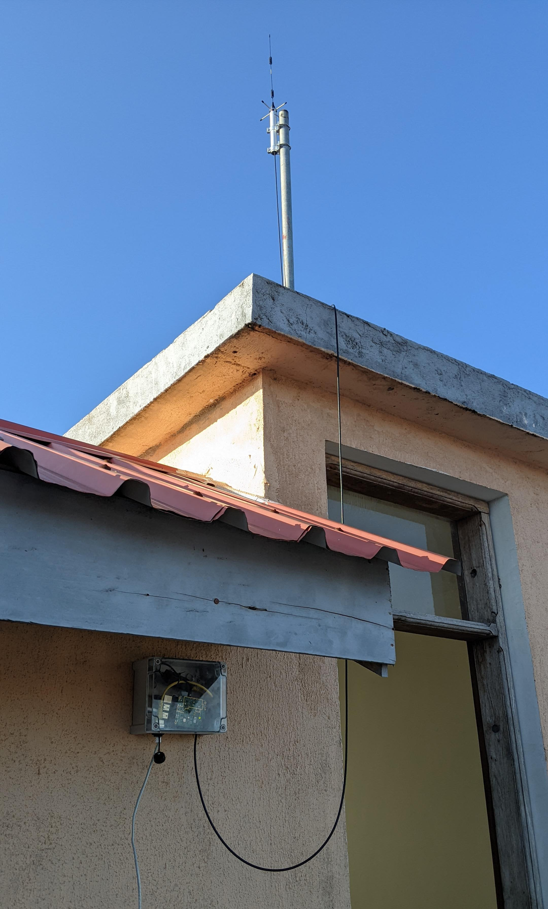
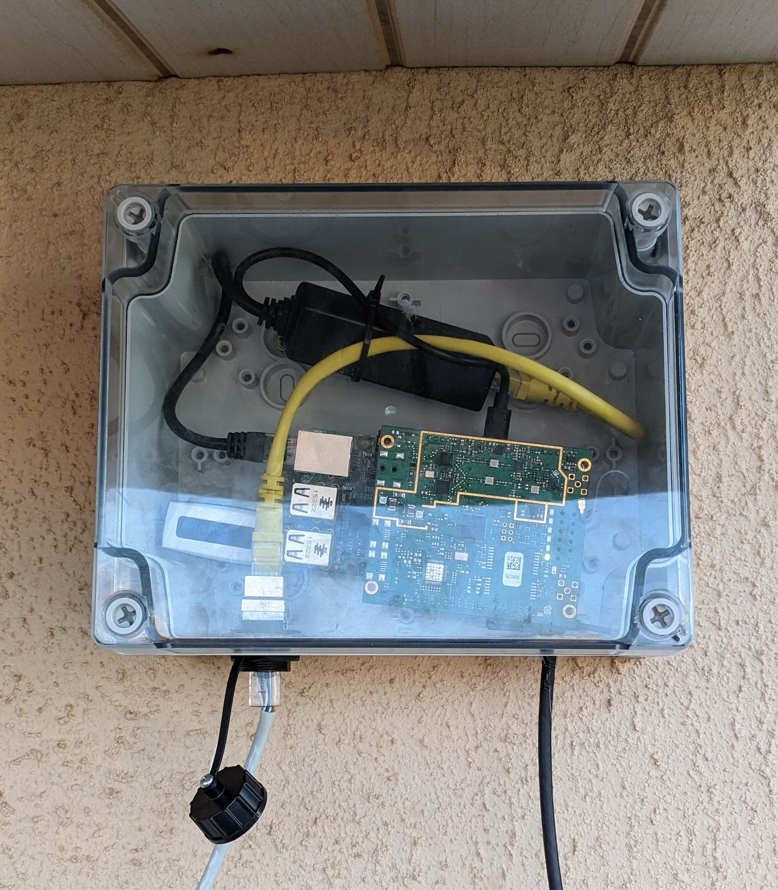
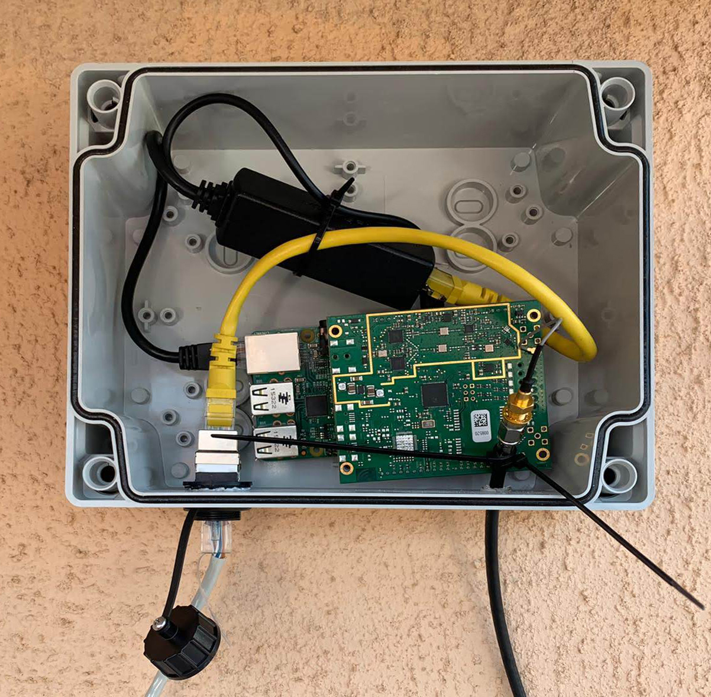

# LoRaWAN Gateway

## Introduction

To setup the LoRaWAN network with The Things Network (TTN) a gateway is needed.
A LoRa gateway is the device that connects the wireless part of the network to the LoRaWAN network server (LNS).
When an end device node, in this case a sensor, transmits it data in the form of radio waves, the gateway can receive the data.
Once received the data is send to the LNS. When using TTN the data is send over internet to TTN's LNS in the cloud.
This way the data is accessible everywhere through internet given the right authentication.
In this case a Raspberry Pi 2B is used with a IMST iC880A LoRaWAN Concentrator with Basic Station, connected to TTN V3 Stack.

## What is needed

### Hardware

To setup the LoRaWAN gateway the following is needed:
- Raspberry Pi + microSD-card
- LoRaWAN Concentrator module
- Windows computer with internet connection
- Router + ethernet cable

In this example we are using:
- Raspberry Pi 2 model B
- <a href="https://wireless-solutions.de/products/lora-solutions-by-imst/radio-modules/ic880a-spi/">IMST iC880A LoRaWAN Concentrator 868MHz</a>

### Software Tools

These aren't mandatory but can be very handy and are used in this example.
- <a href="https://www.raspberrypi.com/software/">Raspberry Pi Imager</a>: a tool to flash an OS to the SD-card.
- <a href="https://git-scm.com/">Git Bash</a>: Linux based command line console for use in Windows, part of the Git version control system.
- <a href="https://nmap.org/download">Nmap Zenmap GUI</a>: to scan the local network for IP addresses.
- <a href="https://filezilla-project.org/">FileZilla</a>: FTP file transfer tool.

If you are using Linux or MacOS you can use the build in command line console when needed.
In Windows you can use the build in Windows PowerShell console or the above mentioned Git Bash. The later is a Linux based command line console which has some benefits over PowerShell.

---