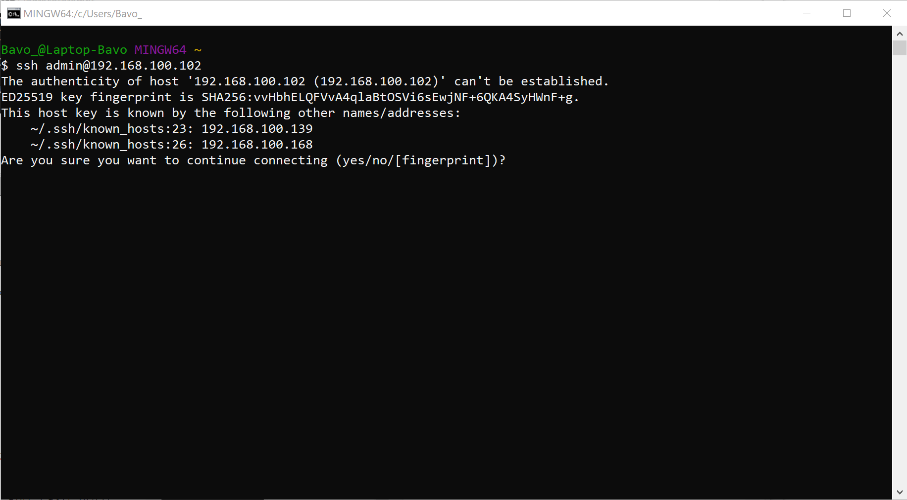
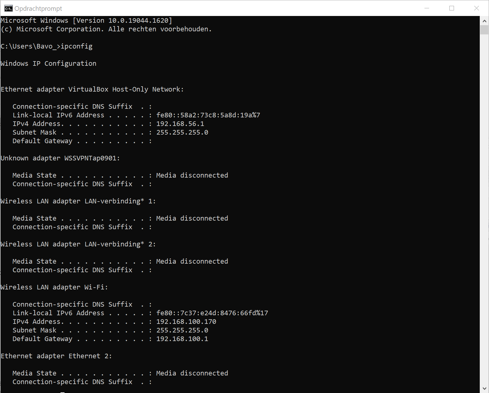
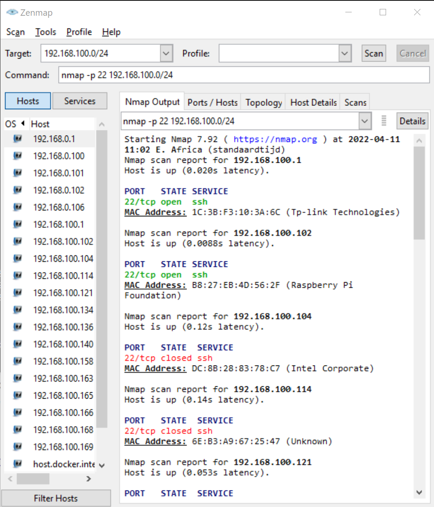

## Setting up the Raspberry Pi

### Using the Raspberry Pi Imager tool flash the OS to the microSD-card.

1. Open the Raspberry Pi Imager.
2. Choose OS: choose Raspberry Pi OS Lite (32-bit).
	>> The RPi 2B needs a 32-bit OS and we don't need a GUI for this use case.
3. Choose Storage: select the microSD-card if not selected automatically.
4. Select the cog wheel to open the advanced settings.
5. Set a different host name (optional).
6. Activate SSH with password authentication by marking the checkbox.
7. Configure the username and password.
8. Configure a WiFi network to connect to automatically.
9. Close the advanced settings window and press the Write button.

When the writing has finished, insert the SD-card in the SD-card slot in the RPi and connect the power supply.
The RPi will now start automatically.
Do not disconnect the power supply while the RPi is running. This can damage the RPi and the SD-card.


### Connecting to the RPi

There are a few different option to connect to the RPi.
Because this is a headless setup, meaning you don't have a Graphical User Interface, we are using SSH in a console.


#### SSH with Hostname

The easiest way to connect to your RPi with SSH is by using the hostname.
However be aware this option might not always work due to multiple RPi's connected to the network having the same hostname.

1. Plug in the power supply and connect the RPi to a router with an ethernet cable, or if you configured the WiFi it should connect automatically.
2. Open a console and type: `ssh [username]@[hostname]`
	```bash
	ssh admin@ttn-gw
	```
3. When connecting for the first time on an ip-addres you will be asked if you want to connect. Type `yes` to add the RPi to the list of known hosts.




#### SSH with ip-addres

If connecting with the hostname doesn't work, or there are multiple RPi's with the same hostname, we can also connect using the ip-addres.
To find it we are using <a href="https://nmap.org/download">Nmap Zenmap GUI</a>. (You can also use nmap in the console.)

1. Plug in the power supply and connect the RPi to a router with an ethernet cable, or if you configured the WiFi it should connect automatically.
2. On Windows, open `cmd` and run `ipconfig"` to identify what ip-address your computer received and take note.
	>>
	>> 
3. Open Zenmap.
4. In the Command line write `nmap -p 22` and the network range your ip-address falls into.
	>> `-p 22` scan port 22 which is the port used for SSH.
	>> Example: my computer got ip-address 192.168.100.170
	>> So the nmap command is: `nmap -p 22 192.168.100.0/24`
	>>
	>> 
5. Identify the RPi in the scan results.
	>> With the MAC addresses you can identify any RPi's in the network because it starts with the manufacturers identification.
	>> Zenmap does this for us and says which is a RPi.
	>> The ip-address is given above the MAC address! Write down both addresses. We will need the MAC address later on.
6. Now that we have the ip-address, open a Git Bash console.
7. Type the command: `ssh [username]@[ip-addres]`
	>> In our example: `ssh admin@192.168.100.102`
8. When connecting for the first time on an ip-addres you will be asked if you want to connect. Type `yes` to add the RPi to the list of known hosts.


Congratulations! You ar now connected to your Raspberry Pi and can start using it.
To make things easier in the future you can also set a static ip-addres for your RPi.
This way the ip-addres is always the same. You can follow <a href="https://www.makeuseof.com/raspberry-pi-set-static-ip/">this guide</a> to set it up.
Be aware this can sometimes create issues in the local network when the ip-addres is already taken.

TIP: It is recommanded to run an update every time you start your RPi.
To do this type the following command: `sudo apt-get update && sudo apt-get -y upgrade`


---